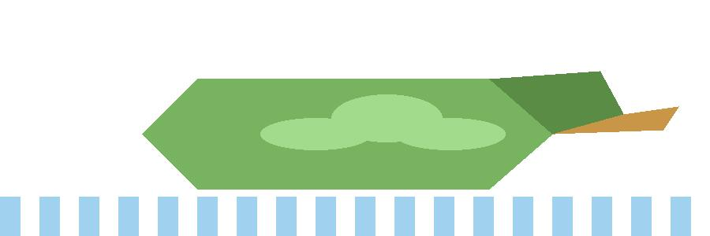

Mallard ducks are a familiar and widespread species of dabbling duck, recognized by the male's iridescent green head and the female's mottled brown plumage. They are highly adaptable birds that thrive in wetlands, lakes, and agricultural landscapes, where they feed on plants, seeds, and small aquatic invertebrates.

Lake Constance is a large freshwater lake in central Europe, shared by Germany, Switzerland, and Austria. It is a productive and biologically rich region, making it an important stopover and breeding area for migratory waterfowl such as mallards.

The GPS tracking data used here records the movement of individual ducks across time and space, revealing patterns in habitat use, migration timing, and seasonal behavior. By following these positions, we can see how mallards move through the landscape and how their activity changes across the year.

<div style="display: flex; justify-content: center;">
  
</div>

```{r}
#| message: false
library(tidyverse)
library(sf)
```

```{r}
#| message: false
#| cache: true
mallards <- readRDS("data/mallards.rds")
```

```{r}
#| message: false
mallards |>
  count(duck_id, sort = TRUE)
```

```{r}
#| message: false
mallards |>
  summarise(
    min_lat = min(lat, na.rm = TRUE),
    max_lat = max(lat, na.rm = TRUE),
    min_long = min(long, na.rm = TRUE),
    max_long = max(long, na.rm = TRUE)
  )
```

```{r}
#| message: false
mallards <- read_csv("data/mallards.csv") |>
  mutate(
    timestamp = as.POSIXct(timestamp, tz = "UTC"),
    month = month(timestamp, label = TRUE, abbr = FALSE),
    month_num = month(timestamp),
    year = year(timestamp),
    season = case_when(
      month_num %in% 3:5 ~ "Spring",
      month_num %in% 6:8 ~ "Summer",
      month_num %in% 9:11 ~ "Autumn",
      TRUE ~ "Winter"
    ),
    season = factor(season, levels = c("Spring", "Summer", "Autumn", "Winter"), ordered = TRUE)
  )

mallards
```
